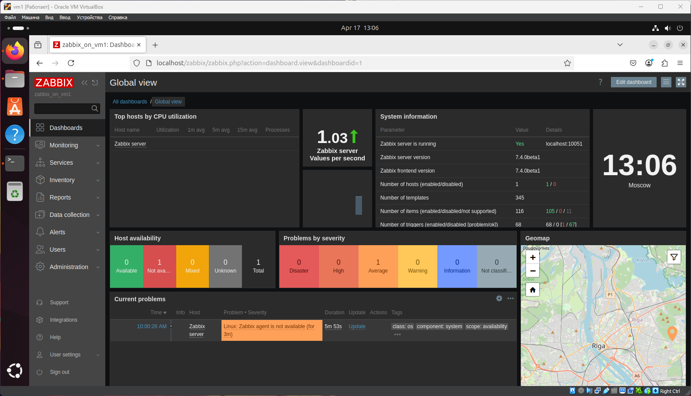
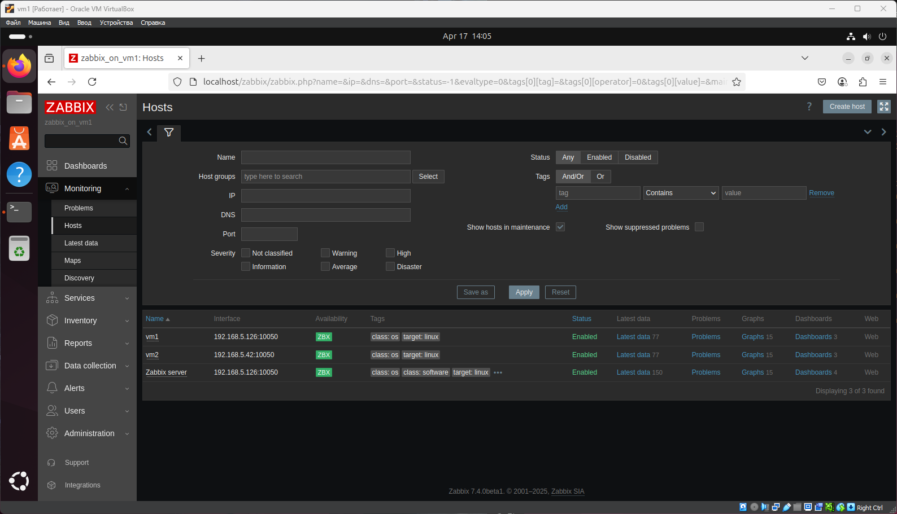
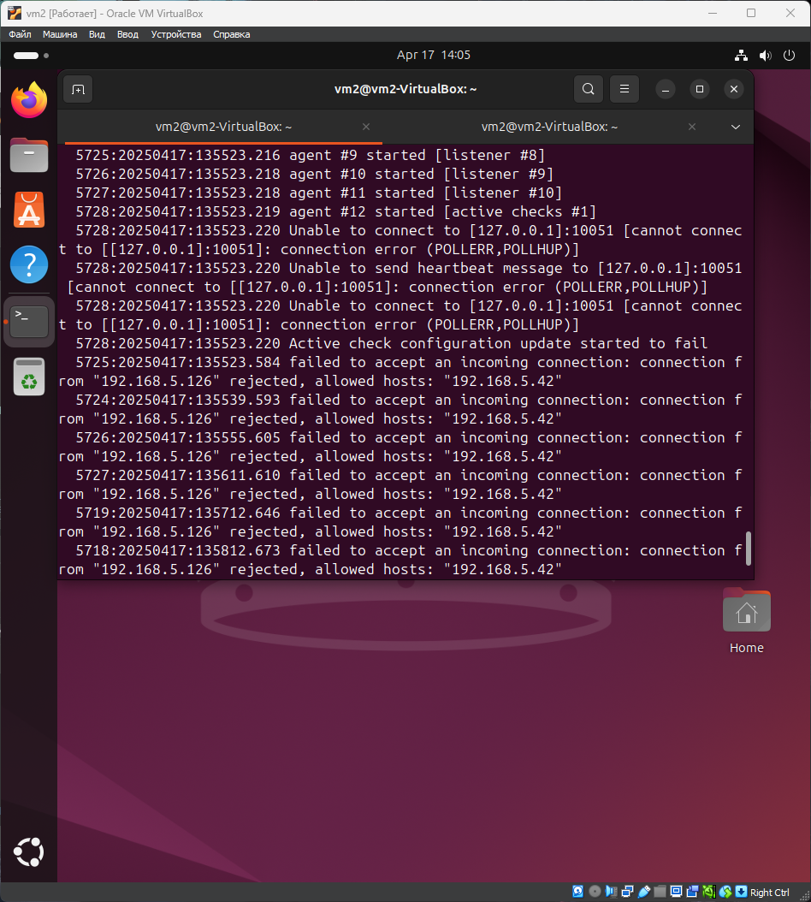
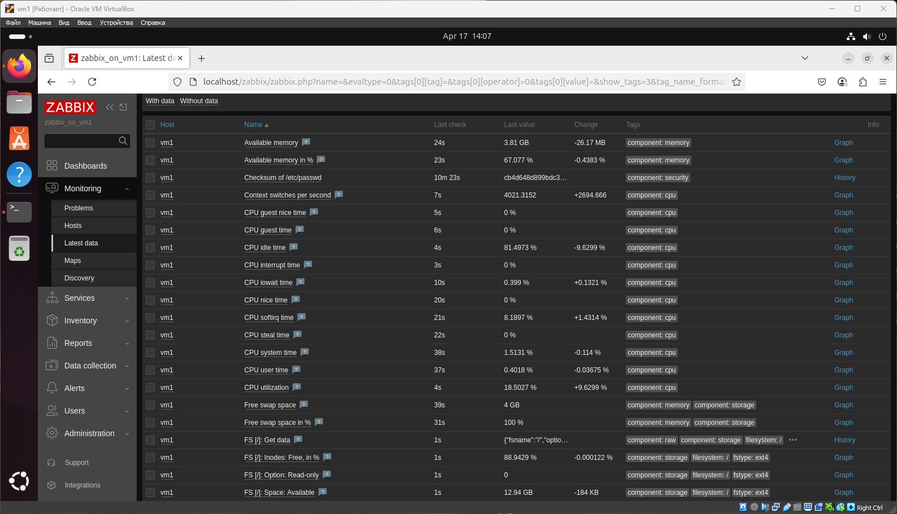

# Домашнее задание к занятию "Система мониторинга Zabbix" - `Сергей Максимов`

## Задание 1. Установите Zabbix Server с веб-интерфейсом

Согласно заданию выбрана последняя версия Zabbix 7.4 для Ubuntu 24.04

1. Установка базы данных PostgreSQL

   `$ sudo apt install postgresql`

2. Установка и распаковка репозитория

   * `$ wget https://repo.zabbix.com/zabbix/7.4/release/ubuntu/pool/main/z/zabbix-release/zabbix-release_latest_7.4%2Bubuntu24.04_all.deb`

   * `$ sudo dpkg -i zabbix-release_latest_7.4+ubuntu24.04_all.deb`

   * `$ sudo apt update`

3. Установка Zabbix сервера, веб-интерфейса

   `$ sudo apt install zabbix-server-pgsql zabbix-frontend-php php8.3-pgsql zabbix-apache-conf zabbix-sql-scripts -y`
   
4. Создание базы данных и пользователя

   * `$ sudo -u postgres createuser --pwprompt zabbix`

   * `$ sudo -u postgres createdb -O zabbix zabbix`

5. Импорт данных на сервер Zabbix

   `$ zcat /usr/share/zabbix/sql-scripts/postgresql/server.sql.gz | sudo -u zabbix psql zabbix`

6. Настройка пароля бызы данных

   `$ sudo vim /etc/zabbix/zabbix_server.conf`
   
   *В файле передаем переменной `DBPassword` наш пароль*

7. Рестарт и добавление в автозагрузку веб сервера и Zabbix сервера

   * `$ sudo systemctl restart zabbix-server apache2`

   * `$ systemctl enable zabbix-server apache2`

#### Скриншот авторизации в админке

---

## Задание 2. Установка Zabbix Agent на два хоста

В качестве одного из хостов использована машина с Zabbix сервером, в качестве второго - чистая ВМ.

1. Установка Zabbix агента

   `$ sudo apt install zabbix-agent`

2. Рестарт и добавление в автозагрузку Zabbix агента

   * `$ sudo systemctl restart zabbix-agent`

   * `$ sudo systemctl enable zabbix-agent`

3. Настраиваем параметры подключения заббикс агента к серверу (прописываем адреса хостов)

   * `$ sudo sed -i 's/Server=127.0.0.1/Server=192.168.5.126/g' /etc/zabbix/zabbix_agentd.conf`

   * `$ sudo sed -i 's/Server=127.0.0.1/Server=192.168.5.42/g' /etc/zabbix/zabbix_agentd.conf`

#### Скриншот раздела configuration

#### Cкриншот лога zabbix agent, где видно, что он работает с сервером

#### Cкриншот раздела `Monitoring > Latest data` для обоих хостов, где видны поступающие от агентов данные.

